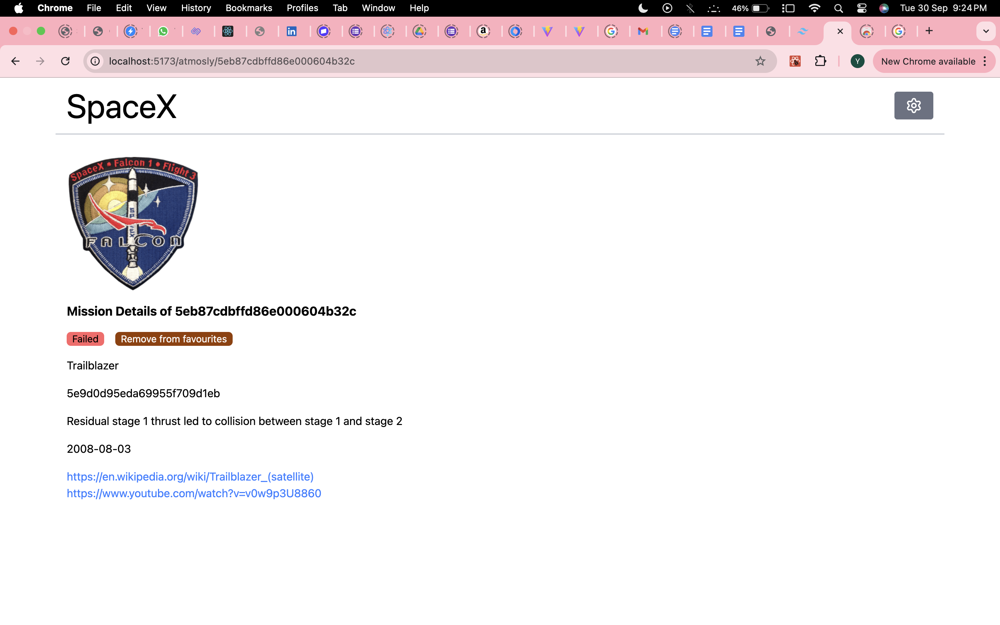
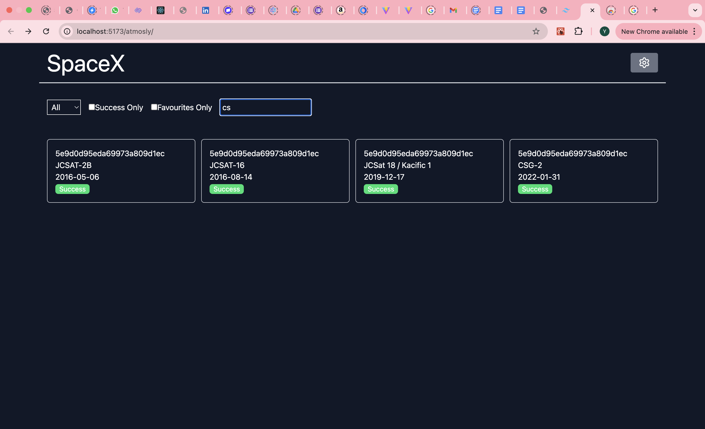

# React + TypeScript + TailwindCSS + Vite

### Live Demo : https://yashshelkegit.github.io/atmosly/

Setup :
1. Clone Project
2. Run `npm install`
3. Run `npm run dev`

Test :
1. Run `npm run test`

Limitation :
1. There is some unknown issue of image rendering in live demo, whereas locally they are visible.
2. Responsive issues in virtualized list(src/VirtualizedMissionGrid.tsx), therefore used normal list.

Snapshots :

TODOs :
1. Styling
2. Text Curations
3. Pagination/Infinite scroll
